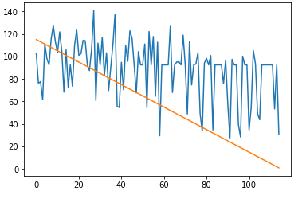

In Keras wird ein RNN mit LSTM gebaut. Programmname: RNN_LSTM_Versuch3.py

Der Datensatz stamm von der Data Challenge 2008 der PHM Society.
Die Trainings und Testdaten wurden durch eine zusätzliche Spalte "RUL" von mir ergänzt.
Siehe train.txt und test.txt

Für das Training verwende ich alle Sensorwerte von 1 bis 21, die Features OP1-3 werden nicht im Training verwendet.
Fast alle Samples werden für das Training verwendet (0-45.000).

Vor dem Training werden die Daten standardisiert.

Die RNN Architektur besteht aus folgender Topologie: ([1, 50, 100, 1]).

Trainiert wird mit einer Batch_size von 50 und 250 Epochen. Verbessert sich der Wert von 'val_loss' nach 30 Durchläufen nicht, so
wird das Training beendet (siehe Early stopping, Keras).

Als Optimizer verwende ich ein selbstdefinierten Adam, welcher in Zeile 26 konfiguriert wird.

Nach mehreren Wochen des versuchens von unterschiedlichen Parametern und RNN Architekturen, ist es mir noch nicht gelungen ein gutes Ergebnis für die Vorhersage der RUL zu erhalten.

20. Juni
Neue Erkenntnis:
Soeben änderte ich den Parameter 'patience' bei callbacks.ReduceLROnPlateau von 5 auf 10 und erhöhrte die Batch_size auf 150
und erreichte zum ersten mal ein Ergebnis der 'val_loss' von unter 3200.

